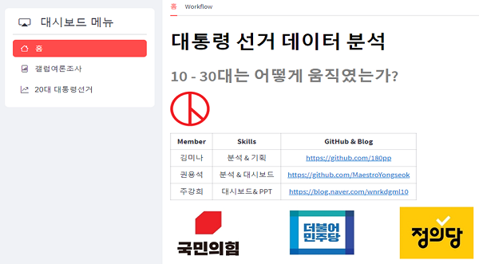

### *팀 프로젝트*

<h1 style='color: black;'>대통령 선거 데이터 분석</h1>
<h2 style='color: gray;'>10 - 30대는 어떻게 움직였는가?</h2>
[Streamlit 링크] (https://electionproject.streamlit.app/) <br/>
[발표 PPT] (https://github.com/MaestroYongseok/Election_Project/blob/main/ppt/%EC%84%A0%EA%B1%B01.pdf) <br/>

## 1. 프로젝트 개요
- 2020년 부터 2022년까지의 갤럽 리서치 조사 자료를 통해 대표정당 3곳에 대한 지지도 변화를 알아봄
- 지지도 변화를 바탕으로 대통력 선거의 득표율과 비교

## 2. 목표 
- 득표율에 영향을 미치는 요소 분석
- 지역별 득표율의 차이 파악
- 대시보드를 통해 예상 득표율 변화를 확인

## 3. 프로젝트 기간
- 2023.5.18 ~ 2023.6.23

## 4. 프로젝트 목적
- Python을 이용하여 GeoPandas를 사용한 지도 시각화 
- 대시보드를 이용하여 자신들의 정당 지지율 변화 파악
- 시계열 분석을 통한 예상 지지율 파악

## 5. 주요기능
- 홈 
  + 멤버소개 / 개요 / 기간 / 목적 / 사용툴
- 갤럽여론조사
  + 데이터확인
  + 2030의 비율차이(데이터 출처)
  + 정당 지지도 추이(표 / 시각화)
- 20대 대통령 선거
  + 지도관련데이터와 득표율 데이터의 병합 
  + 후보자의 득표율 지도 시각화
  
## 6. 설치 방법
+ 버전 확인
    - vscode : 1.74.1
    - python : 3.9.13
    - 라이브러리 : pandas (1.5.3), numpy (1.23.5), plotly (5.14.1), matplotlib (3.7.1), streamlit (1.21.0), seaborn (0.12.2), pingouin (0.5.3), scikit-learn (1.2.2), xgboost (1.7.5), pandas-profiling (3.6.3), streamlit-option-menu (0.3.2), streamlit-folium (0.12.0), mapclassify (2.5.0) openpyxl 

- 프로젝트 경로에서 가상환경 설치 후 접속합니다. (Windows 10 기준)
```bash
virtualenv venv
source venv/Scripts/activate
```

- 라이브러리를 설치합니다. 
```bash
pip install -r requirements.txt
```

- streamlit 명령어를 실행합니다. 
```bash
streamlit run app.py
```